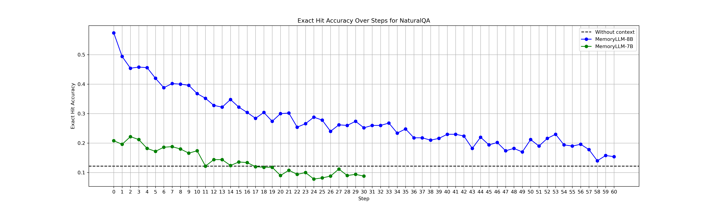
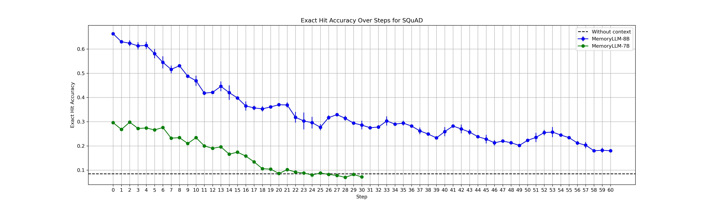
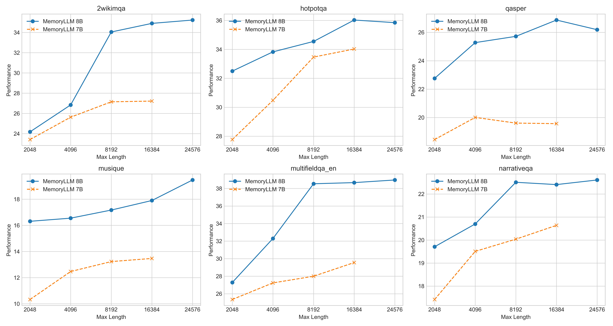

# MemoryLLM & M+

This is the official implementation of paper **MemoryLLM: Towards Self-Updatable Large Language Models** and **M+: Extending MemoryLLM with Scalable Long-Term Memory**.

<p align="center" width="100%">
<!-- put the image "memoryllm.png" -->

</p>

## Official Links

[](https://arxiv.org/abs/2402.04624)
[](https://arxiv.org/abs/2502.00592)  


[](https://huggingface.co/YuWangX/memoryllm-7b)
[](https://huggingface.co/YuWangX/memoryllm-8b)
[](https://huggingface.co/YuWangX/memoryllm-8b-chat)
[](https://huggingface.co/YuWangX/mplus-8b)

<!-- This is the official code for the paper: **MemoryLLM: Towards Self-Updatable Large Language Models**.   
The model is open-sourced at https://huggingface.co/YuWangX/memoryllm-7b -->

## Release Notes
- [2024/02/07] 🔥 The model `mplus-8b` has been uploaded to [mplus-8b](https://huggingface.co/YuWangX/mplus-8b).
- [2024/02/01] 🔥 New paper [M+: Extending MemoryLLM with Scalable Long-Term Memory](https://arxiv.org/abs/2502.00592) is on Arxiv! 
- [2024/08/30] 🔥 We release [memoryllm-8b-chat](https://huggingface.co/YuWangX/memoryllm-8b-chat), the chat model built on top of [memoryllm-8b](https://huggingface.co/YuWangX/memoryllm-8b).
- [2024/08/23] 🔥 We release [memoryllm-8b](https://huggingface.co/YuWangX/memoryllm-8b) with 1.67B memory equipped on Llama3! 
- [2024/06/21] 🔥 Training code is provided in the folder `train`.
- [2024/06/02] 🔥 **MemoryLLM** checkpoint is [released](https://huggingface.co/YuWangX/memoryllm-7b)!
- [2024/05/02] 🔥 **MemoryLLM** is accepted to ICML 2024!

## Getting Started

### Environment Setup
```
conda create --name memoryllm
conda activate memoryllm
pip install -r requirements.txt
```

### Load Model
First clone the repository and get into the repository: 
```
git clone git@github.com:wangyu-ustc/MemoryLLM.git
cd MemoryLLM
```

Then to load `MPlus-8B`, please use the following code: 
```python
import torch
from transformers import AutoTokenizer
from modeling_mplus import MPlus

# load the model mplus-8b (currently we only have the pretrained version)
model = MPlus.from_pretrained("YuWangX/mplus-8b", attn_implementation="flash_attention_2", torch_dtype=torch.bfloat16)
tokenizer = AutoTokenizer.from_pretrained("YuWangX/mplus-8b")
model = model.to(torch.bfloat16) # need to call it again to cast the `inv_freq` in rotary_emb to bfloat16 as well
model.put_ltm_to_numpy() # We include ltm as modules so that it can be uploaded to huggingface, but for inference we need to put ltm on CPU and cast ltm_ags to numpy. 
model = model.cuda()
# After this, the usage of MPlus is the same as MemoryLLM-8B, please check "How to use the model" below. 
```

To load `MemoryLLM-8B` and `MemoryLLM-8B-chat`, please use the following code:
```python
# load pretrained model
model = MemoryLLM.from_pretrained("YuWangX/memoryllm-8b", attn_implementation="flash_attention_2", torch_dtype=torch.bfloat16)
tokenizer = AutoTokenizer.from_pretrained("YuWangX/memoryllm-8b")
model = model.cuda()

# load chat model
model = MemoryLLM.from_pretrained("YuWangX/memoryllm-8b-chat", attn_implementation="flash_attention_2", torch_dtype=torch.bfloat16)
tokenizer = AutoTokenizer.from_pretrained("YuWangX/memoryllm-8b-chat")
model = model.cuda()
```
If you want to use MemoryLLM-7B (the last version), please go to the branch `memoryllm-7b`. 

### How to use the model
Inject a piece of context into the model using the following script:
```python

# Self-Update with the new context
ctx = "Last week, John had a wonderful picnic with David. During their conversation, David mentioned multiple times that he likes eating apples. Though he didn't mention any other fruits, John says he can infer that David also like bananas."

# please make sure the context to inject into the memory is larger than 16 tokens, this is the hard minimum when training the model. The memory will be disturbed when less than 16 tokens are injected into the memory. 
model.inject_memory(tokenizer(ctx, return_tensors='pt', add_special_tokens=False).input_ids.cuda(), update_memory=True)
```

Then for chat model, use the following template: 
```python
# Generation
messages = [{
    'role': 'user', "content": "What fruits does David like?",
}]

inputs = tokenizer.apply_chat_template(messages, return_tensors="pt", add_generation_prompt=True)[:, 1:] # remove bos tokens as the model has its own trained bos embeddings.
terminators = [
    tokenizer.eos_token_id,
    tokenizer.convert_tokens_to_ids("<|eot_id|>")
]

outputs = model.generate(input_ids=inputs.cuda(),
                         max_new_tokens=20,
                         eos_token_id=terminators)

response = tokenizer.decode(outputs[0])
```

For the pretrained model, use the following template:
```python
inputs = tokenizer("Question: What fruits does David like? Answer: David likes", return_tensors='pt', add_special_tokens=False).input_ids.cuda()
outputs = model.generate(input_ids=inputs, max_new_tokens=20)
response = tokenizer.decode(outputs[0][inputs.shape[1]:])
```

### Evaluation

#### Model Editing Evaluations
We put our reimplementation of various model-editing baselines and `MemoryLLM` in the repo [EditingLlama](https://github.com/wangyu-ustc/EditingLlama). 

#### Customized Experiments
To prepare the dataset, please download from [here](https://huggingface.co/datasets/YuWangX/KnowledgeRetention). Please download the dataset and put them as the following structure: 
```
- data
  - squad
    - indices_squad_3.npy
    - dev-v2.0.json
    - train-v2.0.json
  - nq 
    - indices_nq_4.npy
    - v1.0-simplified_nq-dev-all.jsonl
    - v1.0-simplified_simplified-nq-train.jsonl
```
We will evaluate our model on the validation set where the unrelated contexts are sampled from the training set. To evaluate the model, we could use the following script: 

```
mkdir results
python test_qa_memory.py --model YuWangX/memoryllm-7b --nuc 10 --datasets naturalqa squad --num_samples 100
```
here `nuc` means the number of irrelevant contexts, and `naturalqa squad` means the datasets to evaluate the model on.

#### Evaluation on Longbench

```
python longbench_pred.py --model memoryllm-7b --datasets hotpotqa --max_length 16384
```
Here `max_length` is the maximum length used when truncating the context.
Then the generated results are all saved in the folder `longbench` for evaluation.

#### Evaluation results on MemoryLLM-8B
Evaluation results on the knowledge-retention tasks are as follows: (we updated the evaluation dataset by filtering out the examples whose questions can be answered by Llama3-8B. The new dataset is [here](https://huggingface.co/datasets/YuWangX/KnowledgeRetentionProcessed))
<p align="center" width="100%">
<!-- put the image "memoryllm.png" -->

</p>
<p align="center" width="100%">
<!-- put the image "memoryllm.png" -->

</p>

Evaluation results on LongBench are as follows:
<p align="center" width="100%">
<!-- put the image "memoryllm.png" -->

</p>

### Training
In our implementations, we train Llama2-7B on C4 dataset. However, this may lead to the poor performance on the benchmark `qasper` (see Figure 4 in the [paper](https://arxiv.org/pdf/2402.04624)). Thus we put the script of training on red-pajama here, which is the dataset we have been using in the models we are currently exploring. 

Please check the folder `train` using the following command:
```
cd train
```
#### Dataset Preparation
Please follow the instructions below to prepare the datasets: (make sure you have the datasets from [here](https://github.com/wangyu-ustc/MemoryLLM?tab=readme-ov-file#customized-experiments) prepared.)
```
cd data

# Please use the softlink to link the validation datasets into the current directory.
ln -s ../../data/nq ./
ln -s ../../data/squad ./

# Then please download the redpajama dataset
cd redpajama
sh download.sh
```

After preparing all the datasets, you can run the following code to start training:
```
python main.py -t --base MemoryLLM/configs/llama/llama_30x256.yaml
```
We have not conducted training on openllama but we do have the script on openllama for debugging purposes. So if you want to see the training on openllama, please run the following command:
```
python main.py -t --base MemoryLLM/configs/openllama/openllama_4x256.yaml
```

## Citations
If you find this repo helpful, please consider cite our paper:
```
@inproceedings{memoryllm,
  author       = {Yu Wang and
                  Yifan Gao and
                  Xiusi Chen and
                  Haoming Jiang and
                  Shiyang Li and
                  Jingfeng Yang and
                  Qingyu Yin and
                  Zheng Li and
                  Xian Li and
                  Bing Yin and
                  Jingbo Shang and
                  Julian J. McAuley},
  title        = {{MEMORYLLM:} Towards Self-Updatable Large Language Models},
  booktitle    = {Forty-first International Conference on Machine Learning, {ICML} 2024,
                  Vienna, Austria, July 21-27, 2024},
  publisher    = {OpenReview.net},
  year         = {2024},
  url          = {https://openreview.net/forum?id=p0lKWzdikQ},
  timestamp    = {Fri, 06 Dec 2024 12:46:25 +0100},
  biburl       = {https://dblp.org/rec/conf/icml/WangGCJLYYLLYSM24.bib},
  bibsource    = {dblp computer science bibliography, https://dblp.org}
}

@misc{wang2025mextendingmemoryllmscalable,
      title={M+: Extending MemoryLLM with Scalable Long-Term Memory}, 
      author={Yu Wang and Dmitry Krotov and Yuanzhe Hu and Yifan Gao and Wangchunshu Zhou and Julian McAuley and Dan Gutfreund and Rogerio Feris and Zexue He},
      year={2025},
      eprint={2502.00592},
      archivePrefix={arXiv},
      primaryClass={cs.CL},
      url={https://arxiv.org/abs/2502.00592}, 
}
```
